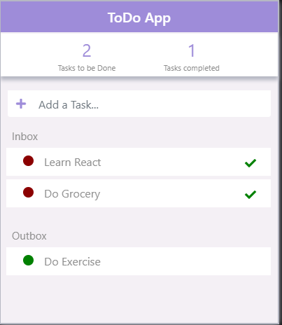

# ToDoApp--React-Learning
- App will let you add and remove tasks.
- To be done tasks added into Inbox section.
- By clicking on checked icon, tasks considered as completed and will be moved to outbox.
- At the top, total number of to be done tasks and removed tasks displayed.

